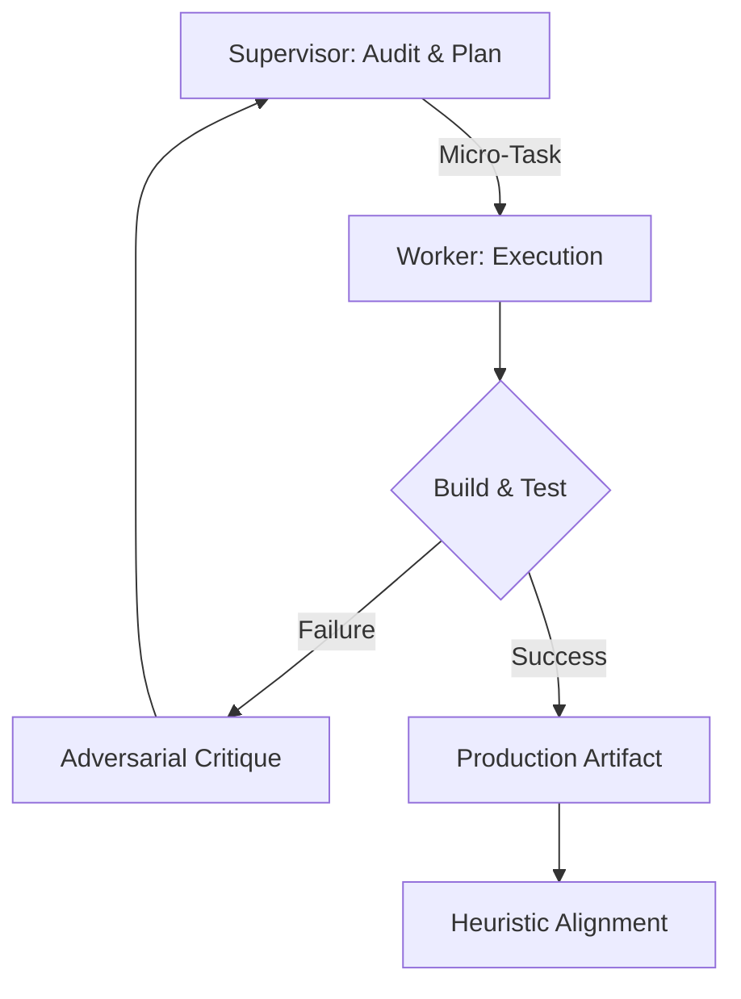

# Rick-And-Morty-Loop: Dual-Agent Orchestration Framework

> **Status:** Production / v4.5
> **License:** Apache 2.0
> **Architecture:** Adversarial Agentic Orchestration (AAO)
> **Mode:** Autonomous Execution Mode (AEM)

## Overview
**Rick-And-Morty-Loop** is an industrial-grade orchestration framework designed for **AI/LLM Orchestration Specialists**. It implements a self-healing **Supervisor-Worker** pattern to automate the software development lifecycle, ensuring production-ready code through continuous adversarial pressure.

By utilizing distinct system prompts—**The Architect (Rick)** for oversight and **The Engineer (Morty)** for execution—the framework creates a deterministic feedback loop that pushes code from conception to deployment with zero human intervention.

## 📂 Repository Structure

```
.
├── ARCHITECTURE.md       # Technical deep-dive & Persona Theory
├── START_GUIDE.md        # Step-by-step user onboarding guide
├── rick-loop.sh          # The AEM Orchestration Engine
├── setup.sh              # Environment pre-flight check script
├── start.sh              # The Universal One-Touch Launcher
├── system-prompts/       # Technical Prompt Library (100+ specialized guides)
│   ├── RICK_OVERSIGHT.md # The Auditor's Cynical Directive
│   └── ELITE_ENGINEER.md # The Worker's Execution Standard
└── README.md             # Project Overview
```

## 🧠 Technical Prompt Library
Rick-And-Morty-Loop includes a comprehensive library of specialized system prompts that the Supervisor (Rick) uses to enforce industry standards across various domains:
*   **Security Audits**: Specialized directives for penetration testing and vulnerability assessment.
*   **Infrastructure**: CI/CD, Docker, and Firebase configuration guides.
*   **Architectural Integrity**: Domain-driven design and Clean Architecture enforcement patterns.

## 🚀 Quick Start (Zero-Friction)

### Prerequisites
*   **Gemini CLI** (The Supervisor)
*   **Copilot CLI** (The Worker)
*   **Git** & **Bash**

### Installation & Launch
1.  **Clone the repository:**
    ```bash
    git clone https://github.com/yourusername/rick-and-morty-loop.git
    cd rick-and-morty-loop
    ```
2.  **Ignite the Engine:**
    ```bash
    ./start.sh
    ```
    *The `start.sh` script will automatically verify your system dependencies, create the `.env` configuration from a template, initialize the documentation state, and provide you with a Quick Start guide for your first mission.*

## 🚀 The AEM Workflow



## 🧠 Strategic Personality Mapping
In professional AI orchestration, **Adversarial Validation** is the only way to prevent context drift and sycophancy.

1.  **The Supervisor (Gemini 2.0 Pro)**: Utilizing a **2M Token Context Window**, the Supervisor maintains a global architectural map of the entire repository. He is the anchor of integrity.
2.  **The Worker (Claude 3.7 Sonnet/Opus)**: Utilizing a **200K Token Context Window**, the Worker is optimized for surgical code implementation.

### The 50/100 Rule of Cognitive Decay
Rick-And-Morty-Loop is built on the observation that LLM intelligence is inversely proportional to context saturation. As an LLM approaches 50% of its window, reasoning begins to degrade; at 100%, it enters "Cognitive Collapse." The framework actively manages the Worker's context to keep it in the "Peak Intelligence Zone" (<50% usage).

## 🔧 Operational Features
*   **Self-Healing Infrastructure**: Automated Git-checkpointing after every execution turn.
*   **Distributed Ledger State**: Persistent flat-file state synchronization (`context.md`).
*   **Context Optimization**: Recursive context management to prevent model degradation at high token usage.
*   **Pre-execution Security**: Static analysis for prompt injection prevention.

## 🛠 Troubleshooting
| Issue | Potential Cause | Solution |
| :--- | :--- | :--- |
| **API 429 Error** | Rate limiting on Gemini/Claude | Increase sleep timer in `rick-loop.sh`. |
| **Git Commit Fail** | Missing user configuration | Run `git config --global user.email "you@example.com"`. |
| **Stagnation Loop** | Context window saturation | Clear `documentation/context.md` and reset status. |
| **Permission Denied** | Script not executable | Run `chmod +x *.sh`. |

## 🗺 Roadmap
- [ ] **Sandboxed Executors**: Integration with `Bubblewrap` and `Docker` for secure agentic execution.
- [ ] **Telemetry Suite**: Real-time tracking of Token-to-Instruction (TTI) efficiency and perplexity scores.
- [ ] **Vector RAG Integration**: Dynamic prompt retrieval from the technical library based on real-time codebase analysis.
- [ ] **Automated Unit Testing**: Real-time test generation during the Audit phase.
- [ ] **Multi-Agent Swarms**: Orchestrating parallel microservice deployments.

## 📄 License
Licensed under the **Apache License 2.0**. This provides professional-grade IP protection, explicit patent grants, and contributor liability limitations—making it suitable for enterprise-level AI orchestration.

## 🛡️ Security & Reliability
Rick-And-Morty-Loop is built with an "Assume Compromise" mindset:
*   **Adversarial Audit**: The Supervisor assumes the Worker's output is flawed or malicious.
*   **Immutable Checkpoints**: Every turn is snapshotted via Git, allowing for instantaneous disaster recovery.
*   **Decoupled Logic**: The "Brain" (LLM) is separated from the "Hand" (Shell), allowing for granular permission management.

---
**"The Singularity is just a properly configured loop."**